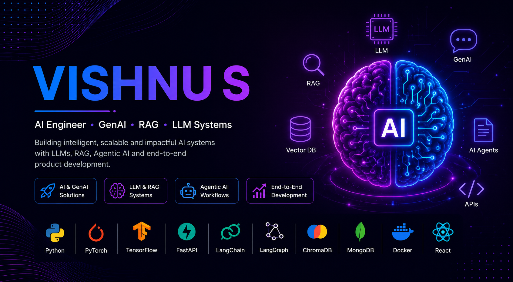

<H1>About Me</H1> 

```python
class VishnuS:

    def __init__(self):
        self.role = "AI/ML Engineer"
        self.university = "VIT Bhopal"
        self.experience = "Research Intern @ NIT Calicut"

        self.interests = [
            "Machine Learning",
            "Deep Learning",
            "Generative AI",
            "Agentic AI",
            "Computer Vision"
        ]

        self.tech_stack = [
            "Python",
            "TensorFlow",
            "PyTorch",
            "FastAPI",
            "LangChain",
            "LangGraph",
            "React"
        ]

        self.current_projects = [
            "ModelSmith AutoML",
            "Competitor Intelligence Agent",
            "AI Doctor"
        ]

        self.mission = "Building AI systems that solve real-world problems"
```

<h2 align="center">Featured Projects</h2>

<table>
<tr>
<td width="50%">
<h3 align="center"> ModelSmith</h3>
<p align="center"><b>LLM-Powered Autonomous AutoML System</b></p>

<p>
Built an intelligent AutoML platform with LLM-driven dataset profiling, automatic model selection, Optuna hyperparameter tuning, staged model evaluation, secure Docker sandbox execution and FastAPI backend.
</p>

<p align="center">


</p>
</td>

<td width="50%">
<h3 align="center"> Competitor Intelligence Agent</h3>
<p align="center"><b>LangGraph Multi-Agent RAG System</b></p>

<p>
Autonomous market monitoring system using Playwright scraping, NewsAPI monitoring, ChromaDB vector storage, LangGraph multi-agent workflow, RAG-powered analysis and automated PDF battle-card generation.
</p>

<p align="center">


</p>
</td>
</tr>

<tr>
<td width="50%">
<h3 align="center">AI Doctor</h3>
<p align="center"><b>Multi-Model Medical Prediction System</b></p>

<p>
Healthcare AI system combining NLP-based disease prediction using LSTM networks and medical prediction using CNN models, integrated with FastAPI backend and React frontend.
</p>

<p align="center">


</p>
</td>

<td width="50%">
<h3 align="center">ViT OCR</h3>
<p align="center"><b>Vision Transformer Handwritten Text Recognition</b></p>

<p>
Research internship project at NIT Calicut focused on multilingual handwritten text recognition using Vision Transformers, OpenCV preprocessing, TensorFlow training and FastAPI inference.
</p>

<p align="center">


</p>
</td>
</tr>
</table>


<h2 align="center">⚡ Tech Arsenal</h2>

<p align="center">

</p>

<p align="center">
 Machine Learning • Deep Learning • Computer Vision • NLP • LLMs • Generative AI • RAG • Agentic AI • Semantic Search • LangChain • LangGraph • ChromaDB • Optuna • REST APIs
</p>


<h2 align="center">📫 Connect With Me</h2>

<p align="center">
<a href="https://www.linkedin.com/in/vishnu-s-3b483227a/">

</a>

<a href="mailto:vishnus202004@gmail.com">

</a>
</p>
